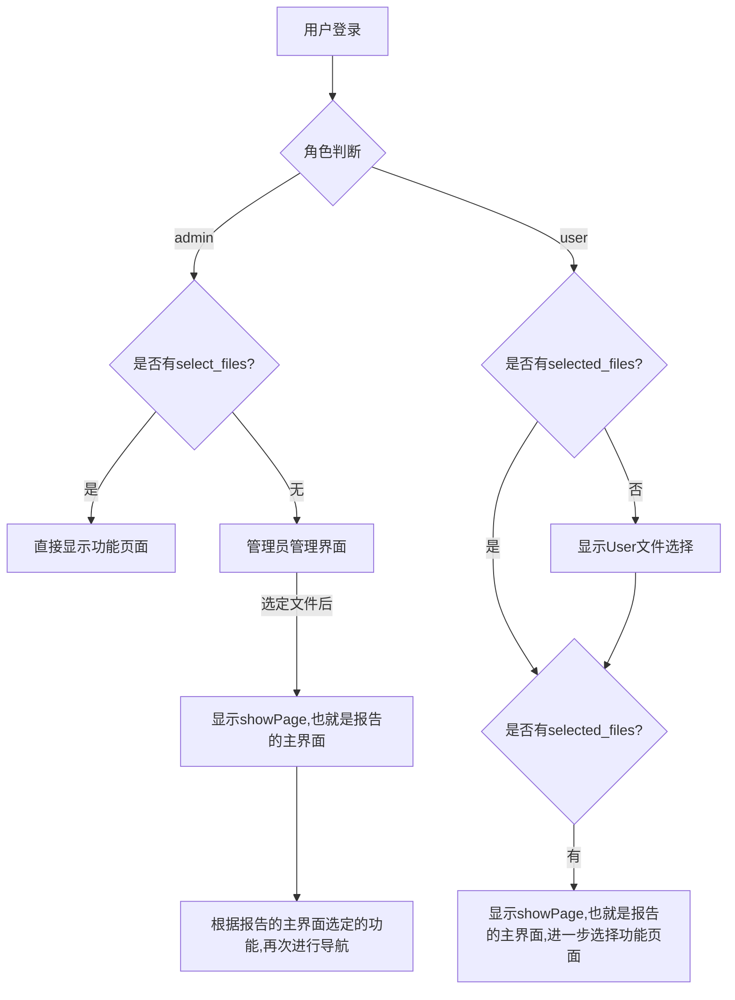

## 页面分类
- 用户,管理员选择文件的界面与currentPage并不绑定

- showpage,也就是报告页面用currentpage管理

- current_page参数可以为之后进一步增加的功能预留接口

## 导航逻辑:
- 当处于登录状态,但是current_Page以及user_select_file是空的,则导航到用户或者管理员界面

- 登录状态以及user_select_file为真,则导航到showPage

- showPage中,进一步选择current_page,则导航到current_page所指向的文件

- ! *管理员在选择文件时,也会将authentification_username修改为文件所属用户的名字,以便于查询(本身没有影响)*

    -   后续可以将用户选择文件以及管理员选择文件进行分离.

- admin界面的账户更新功能还有欠缺,不好修改密码,需要删除账户而后创建同名账户

## 文件地址结构
每个用户的名下存储一个文件夹
  该文件夹代表着一次文件的选择

在该文件中,可能会混杂着多个toppic所给出的内容

需要去进行相应的识别,并且在report界面进行侧边栏的选择
- 使用for循环来进行识别,拆分为多个列表
- 

## TODO:
- 对基本的功能进行细节上的优化
- 修改文件识别逻辑,添加一个用户名筛选的接口
- 进行页面的拆分,确保可以使用命令行来实现TDvis的调用
  - 添加report界面的文件选择功能

TODO: 
- toppic中的文件查询功能还存在bug
- 在管理员用户信息修改的部分,其数据库的修改没有进行同步
- 在退出时进行状态的清空
- 改成单选

- 修改成tab的文件查看方式

- 添加自动建库的流程,以便于用户进行本地部署