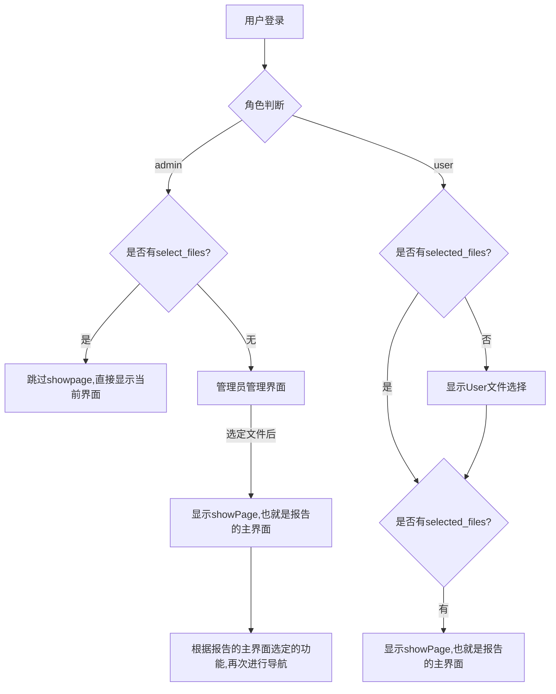

- 用户,管理员选择文件的界面以及报告界面与currentPage并不绑定

- 当处于登录状态,但是current_Page以及user_select_file是空的,则导航到用户或者管理员界面

- 登录状态以及user_select_file为真,则导航到showPage

- showPage中,进一步选择current_page,则导航到current_page所指向的文件

- 管理员在选择文件时,也会将authentification_username修改为文件所属用户的名字,以便于查询(本身没有影响)
- 后续可以将用户选择文件以及管理员选择文件进行分离.

- admin界面的账户更新功能还有欠缺,不好修改密码